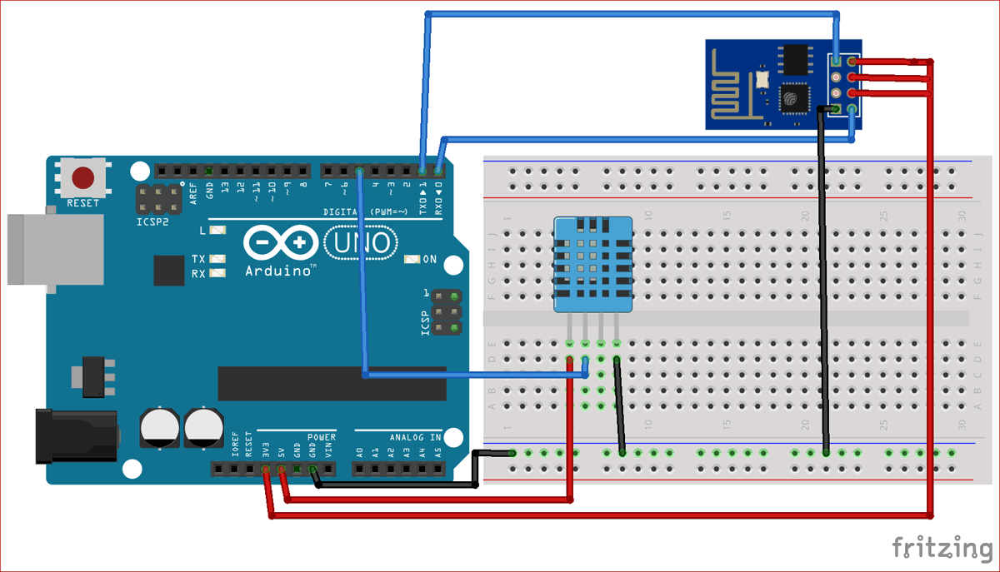

# Temperature-sensor
Controlling a fan or an AC with the help of temperature sensor.
Make all the connections using jumper wires on Arduino.
Use Blynk app to control the electronic device with phone.
# How to connect wifi module with Blynk app?
Explained in the link- https://create.arduino.cc/projecthub/adithya-tg/control-arduino-uno-using-esp8266-wifi-module-and-blynk-app-504494
# Circuit Diagram

